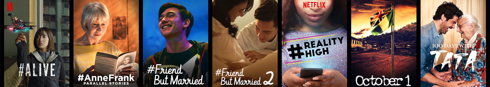
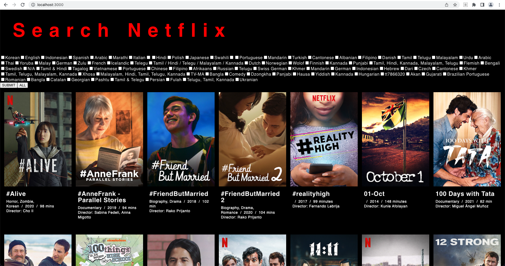
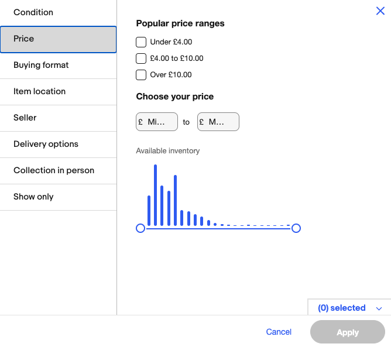
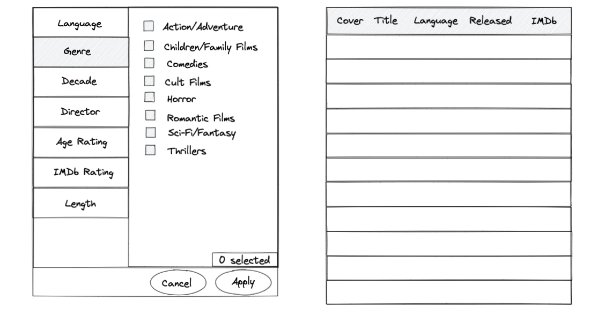
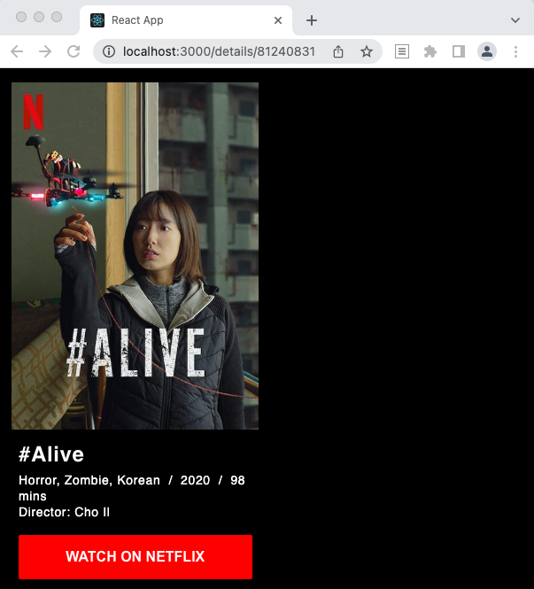
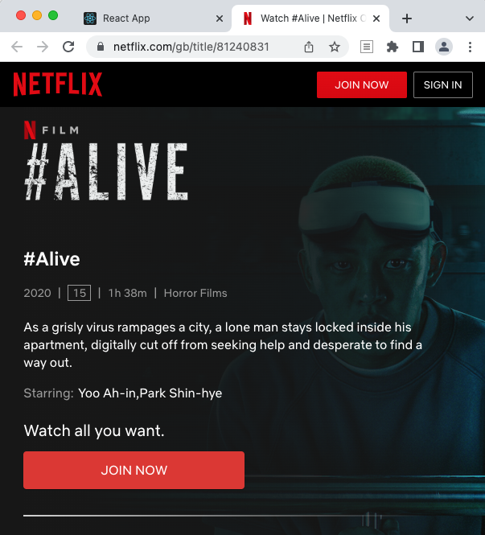
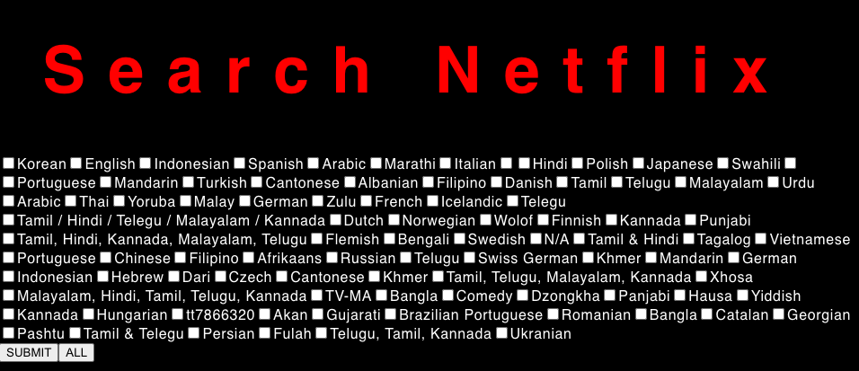

</img>

# **General Assembly Project 2: <br>Netflix Advanced Search Application 1.0**

### Outline

<!-- START doctoc generated TOC please keep comment here to allow auto update -->
<!-- DON'T EDIT THIS SECTION, INSTEAD RE-RUN doctoc TO UPDATE -->

- [Description](#description)
- [Deployment link](#deployment-link)
- [Code Installation](#code-installation)
- [Timeframe & Working Team](#timeframe--working-team)
- [Technologies Used](#technologies-used)
- [Brief](#brief)
- [Planning](#planning)
- [Build/Code Process](#buildcode-process)
- [Challenges](#challenges)
- [Wins](#wins)
- [Key Learnings & Takeaways](#key-learnings--takeaways)
- [Bugs](#bugs)
- [Future Improvements](#future-improvements)

<!-- END doctoc generated TOC please keep comment here to allow auto update -->

<div align="center">
</img>
</div>
&nbsp;

## Description

_“Did you know that there is a film in Swiss German on Netflix?”_

In this project I built an advanced search app for Netflix using React. I focused on creating a search function that can filter the Netflix film database by languages. My aim was to offer up all the language options that are available on Netflix, not just the popular or well-known ones.

While working on this project I struggled with understanding the concept of props and state, which is reflected in the code. I revisited this project in Project 4 after working on my understanding of these concepts. It was satisfying to do it properly and I did a much better job as well.

I am sharing this project as a learning experience and to show the improvement between this and Project 4.

### Deployment link

Project 2 is deployed here: [Netflix Advanced Search 1.0](https://search-netflix.netlify.app/)

Project 4 is deployed here: [Netflix I'm not Chilled!](https://netflix-im-not-chilled.netlify.app/)


### Code Installation

* Clone or download the repo.
* In the terminal check that you have Node.js installed: `node --version`
* Move into the app directory (i.e. where package.json is located) and run: `npm install`
* Start server with terminal command: `npm start`
* The app will open in the browser. 
* If no images load check for a CORS error message in the console. Use a browser extension to allow CORS temporarily.

### Timeframe & Working Team

A solo project completed in two weeks, a few hours most days.

### Technologies Used

#### **Front end:**

* JavaScript (ES6)
* React.js
* CSS3
* React Router Dom

#### **API used:**

* The movies database from [whats-on-netflix.com](https://www.whats-on-netflix.com/), an undocumented API available [here](https://www.whats-on-netflix.com/wp-content/plugins/whats-on-netflix/json/movie.json). 

#### **Dev tools:**

* VS Code
* npm
* Insomnia
* Git/Github
* Google Chrome Developer Tools
* Excalidraw (Wireframing)
* Netlify (deployment)

### Brief

* Consume a public API.
* The app should include a router with several pages.
* Include wireframes that were designed before building the app.
* Have semantically clean HTML.
* Be deployed online and accessible to the public.

## Planning

My original goal was to create a comprehensive advanced search function. This would have included search, filter and sort capabilities in multiple categories. I used Ebay's advanced search as a model and created wireframes to guide my work.

<div align="center">
</img><br>
<i>(Screenshot of Ebay’s advanced search function. Source: ebay.co.uk)</i>
</div>
&nbsp;

<div align="center">
</img><br>
<i>(Wireframes of the planned search modal)</i>
</div>
&nbsp;

I used Trello to keep track of the build process and planned to work in this order: 

* a home page with all films, 
* a film detail page,
* a search function. 

I made the mistake of doing the CSS for each page before moving on to the next one, which was time-consuming and not the most efficient approach. I had to give up on the idea of a comprehensive search function and only implement the language filter in this project.

## Build/Code Process

#### The home page with all films: 

I queried the API to see the structure of the data for each film:

```
 {
    "title": "#Alive ",
    "type": "Movie",
    "titlereleased": "2020",
    "image_landscape": "https://www.whats-on-netflix.com/wp-content/uploads/covers/alive.jpeg",
    "image_portrait": "https://www.whats-on-netflix.com/wp-content/uploads/covers/alive.jpeg",
    "rating": "TV-MA",
    "quality": "SuperHD",
    "actors": "Yoo Ah-in, Park Shin-hye",
    "director": "Cho Il",
    "category": "Horror, Zombie, Korean",
    "imdb": "6.2/10",
    "runtime": "98 mins",
    "netflixid": "81240831",
    "date_released": "2020-09-08",
    "description": "As a grisly virus rampages a city, a lone man stays locked inside his apartment, digitally cut off from seeking help and desperate to find a way out.",
    "language": "Korean"
  },
```

I used the data and the poster image URL to create a card for each film. Then I mapped the array of films to display them all on the homepage. I added a hyperlink to each card and routed it to the detail page of the specific film.

#### The film detail page:

Clicking on the film card opens the detail page for that film. The page retrieves the film ID from the URL and uses it to fetch the details of the specific film from the API. These are then displayed on the page.

The film ID from the API is also the Netflix ID of the film. I used this to create a URL pointing to the official Netflix page of the specific film. I added this URL to a "Watch on Netflix" button on the detail page. This allows the users to go directly to the official Netflix page for the film and start watching it:

```
<button className="btn-red">
    <a href={`https://www.netflix.com/gb/title/${film?.netflixid}`} key={film?.netflixid} target="_blank" rel="noreferrer" >WATCH ON NETFLIX</a>
</button>
```

<div align="center">
</img>
</img><br>
<i>(Clicking on the ‘Watch on Netflix’ button will take the user to the Netflix page of that film.)</i>
</div>
&nbsp;

#### The search function:

I wanted the filtering options to show all available choices, not just the popular ones. To achieve this the list of available languages is generated by filtering the film database. This way we get all the languages that films are available in at the time. This process runs every time the app loads, so the list is always up to date:

```
const filterForTheseLanguages = [
   ...new Set(films.map((film) => film.language)),
 ];
```

I use this list to generate the list of languages the user can filter for:

```
     <form>
       {filterForTheseLanguages.map((lang, idx) => {
         return (
             <div key={idx}>
               <input
                 type="checkbox"
                 name="languages"
                 id={idx}
                 value={lang}
                 onChange={handleChange}
               />
               <label htmlFor={idx}>{lang}</label>
             </div>
       )
       })}
     </form>
```

The list of available languages will always be up to date and available for the user to choose from: 

<div align="center">
</img>
</div>
&nbsp;

Clicking on the logo will take the user back to the homepage. 

### Challenges

I found it challenging when during module 2 I didn't have a good grasp on the topic, particularly the concept of props and state. I ended up wrapping up the project in a rush and it really shows in the code. I felt like I wasn't finished with it. I revisited this project in Project 4. It was a huge improvement and personally very satisfying to do it properly.

### Wins

Being able to access APIs and use all that available data for my projects was really fun. I was pleasantly surprised to find unexpected data from what we thought was a well-known source, like films in Swiss German on Netflix. 

## Key Learnings & Takeaways

* This was my first react app and the increase in the complexity was a learning curve.
* Switching from a single script file to keeping everything in modules means it's important to map out the structure of the modules in advance.
* I enjoyed accessing data from APIs and pulling out anything that I was interested in. Querying APIs is a powerful tool.
* I learned that CSS takes up a lot of time, so I'll make sure to do it as the last step of the project from now on.

## Bugs

* CORS: I have to use a browser extension to allow CORS temporarily. This is less than ideal and potentially a security risk.
* The app takes a long time to load.
* There are errors in the list of languages.
* The submit button doesn’t work.
* The letters of the logo get pressed together when viewed on a small screen, the app was not designed mobile-first.
* The search related checkboxes were meant to show on a modal in front of the film list, not on the same page at the top.
* The code is very messy and difficult to read.

## Future Improvements

There is a lot I wanted to improve on this app. First I wanted to gain a much better understanding of React before I ventured further. After that I wanted to work on the code’s structure and readability. The code ended up messy and difficult to read, so this would be the largest improvement. Once I did these then these are the features I wanted to add when I revisit this project: 

* Add in all the other search/filter categories.
* Add sorting options.
* Add a button to clear search terms.
* Place all the search related checkboxes on a modal in front of the film list.
* Make a nicer layout for the film detail page.
* Expand the search to tv shows as well.
* Add pagination and infinite scrolling.

I revisited this project in Project 4. I improved it a lot and implemented many of the above features. Project 4 is available here: [Netflix I'm not Chilled!](https://netflix-im-not-chilled.netlify.app/)